# Housing Management System - UML Diagrams & Architecture

## 1. Entity Relationship Diagram (ERD)

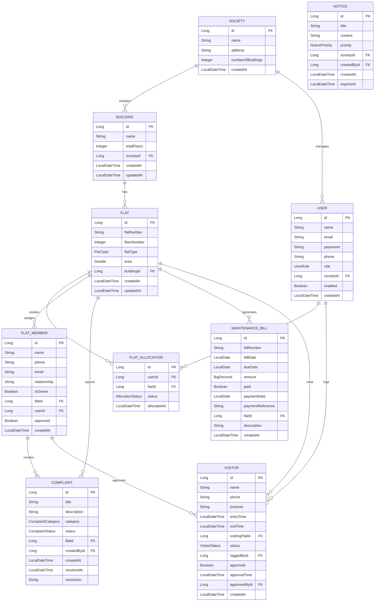

## 2. Class Diagram - Core Domain Model

```mermaid
classDiagram
    class Society {
        -Long id
        -String name
        -String address
        -Integer numberOfBuildings
        -List~Building~ buildings
        -List~User~ admins
        -LocalDateTime createdAt
        +getId() Long
        +getName() String
        +getBuildings() List~Building~
    }

    class Building {
        -Long id
        -String name
        -int totalFloors
        -Society society
        -List~Flat~ flats
        -LocalDateTime createdAt
        -LocalDateTime updatedAt
        +getId() Long
        +getName() String
        +getFlats() List~Flat~
    }

    class Flat {
        -Long id
        -String flatNumber
        -Integer floorNumber
        -FlatType flatType
        -Double area
        -Building building
        -Set~FlatAllocation~ flatAllocations
        -Set~Complaint~ complaints
        -FlatMember member
        -List~MaintenanceBill~ maintenanceBills
        +getId() Long
        +getFlatNumber() String
        +getBuilding() Building
    }

    class User {
        -Long id
        -String name
        -String email
        -String password
        -String phone
        -UserRole role
        -Society society
        -Set~FlatAllocation~ flatAllocations
        -boolean enabled
        +getId() Long
        +getEmail() String
        +getRole() UserRole
        +getAuthorities() Collection~GrantedAuthority~
    }

    class FlatMember {
        -Long id
        -String name
        -String phone
        -String email
        -String relationship
        -boolean isOwner
        -Flat flat
        -User user
        -boolean approved
        +getId() Long
        +isOwner() boolean
        +getFlat() Flat
    }

    class Complaint {
        -Long id
        -String title
        -String description
        -ComplaintCategory category
        -ComplaintStatus status
        -Flat flat
        -FlatMember createdBy
        -LocalDateTime createdAt
        -LocalDateTime resolvedAt
        -String resolution
        +getId() Long
        +getStatus() ComplaintStatus
        +resolve(String resolution) void
    }

    class MaintenanceBill {
        -Long id
        -String billNumber
        -LocalDate billDate
        -LocalDate dueDate
        -BigDecimal amount
        -boolean paid
        -LocalDate paymentDate
        -String paymentReference
        -Flat flat
        +getId() Long
        +isPaid() boolean
        +markAsPaid(String reference) void
    }

    class Visitor {
        -Long id
        -String name
        -String phone
        -String purpose
        -LocalDateTime entryTime
        -LocalDateTime exitTime
        -Flat visitingFlat
        -VisitorStatus status
        -User loggedBy
        -boolean approved
        -FlatMember approvedBy
        +getId() Long
        +approve(FlatMember approver) void
        +markExit() void
    }

    %% Relationships
    Society ||--o{ Building : contains
    Building ||--o{ Flat : has
    Flat ||--o{ FlatMember : resides
    User ||--o{ FlatMember : registers
    Flat ||--o{ Complaint : reports
    Flat ||--o{ MaintenanceBill : generates
    Flat ||--o{ Visitor : visits
    FlatMember ||--o{ Complaint : creates
    User ||--o{ Visitor : logs

    %% Enums
    class UserRole {
        <<enumeration>>
        ADMIN
        RESIDENT
        GUARD
    }

    class FlatType {
        <<enumeration>>
        ONE_BHK
        TWO_BHK
        THREE_BHK
        FOUR_BHK
        PENTHOUSE
    }

    class ComplaintStatus {
        <<enumeration>>
        PENDING
        IN_PROGRESS
        RESOLVED
        REJECTED
    }

    class ComplaintCategory {
        <<enumeration>>
        MAINTENANCE
        SECURITY
        NOISE
        PARKING
        CLEANLINESS
        OTHER
    }

    class VisitorStatus {
        <<enumeration>>
        PENDING
        APPROVED
        REJECTED
        IN_PREMISES
        EXITED
    }
```

## 3. Use Case Diagram

```mermaid
graph TD
    Admin([Admin])
    Resident([Resident])
    Guard([Guard])
    System([Housing Management System])

    %% Admin Use Cases
    Admin --> UC1[Manage Society]
    Admin --> UC2[Manage Buildings]
    Admin --> UC3[Manage Flats]
    Admin --> UC4[Manage Users]
    Admin --> UC5[Handle Complaints]
    Admin --> UC6[Generate Bills]
    Admin --> UC7[Create Notices]
    Admin --> UC8[View Reports]

    %% Resident Use Cases
    Resident --> UC9[Register Family Members]
    Resident --> UC10[File Complaints]
    Resident --> UC11[View Bills]
    Resident --> UC12[Pay Bills]
    Resident --> UC13[Approve Visitors]
    Resident --> UC14[View Notices]
    Resident --> UC15[Update Profile]

    %% Guard Use Cases
    Guard --> UC16[Log Visitors]
    Guard --> UC17[Monitor Entries]
    Guard --> UC18[View Visitor Status]
    Guard --> UC19[Emergency Alerts]

    %% System Features
    UC1 --> System
    UC2 --> System
    UC3 --> System
    UC4 --> System
    UC5 --> System
    UC6 --> System
    UC7 --> System
    UC8 --> System
    UC9 --> System
    UC10 --> System
    UC11 --> System
    UC12 --> System
    UC13 --> System
    UC14 --> System
    UC15 --> System
    UC16 --> System
    UC17 --> System
    UC18 --> System
    UC19 --> System
```

## 4. Sequence Diagram - User Authentication Flow

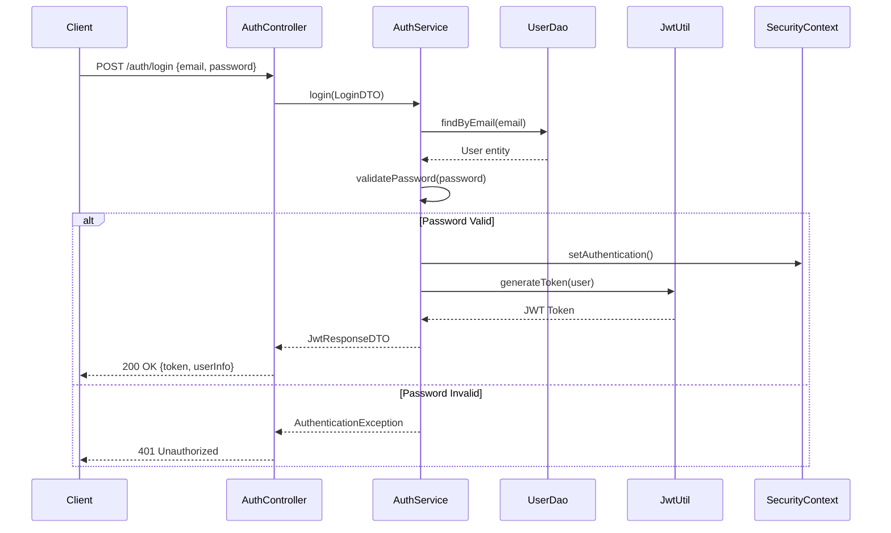

## 5. Sequence Diagram - Complaint Management Flow

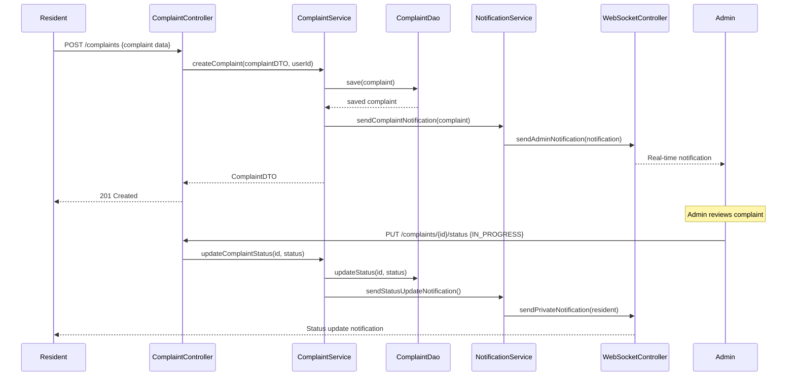

## 6. Sequence Diagram - Visitor Management Flow

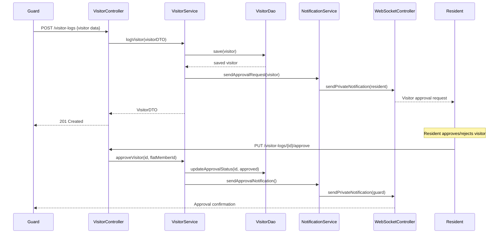

## 7. Activity Diagram - Bill Generation Process

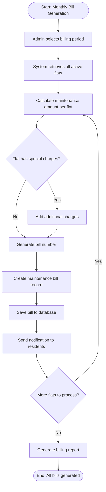

## 8. Component Diagram - System Architecture

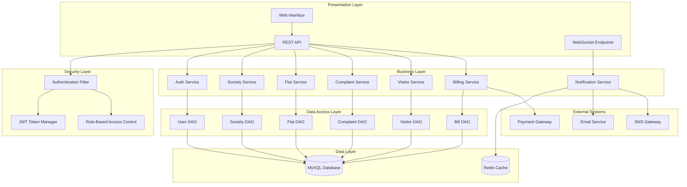

## 9. Deployment Diagram

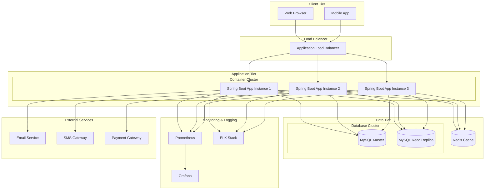

## 10. State Diagram - Complaint Lifecycle

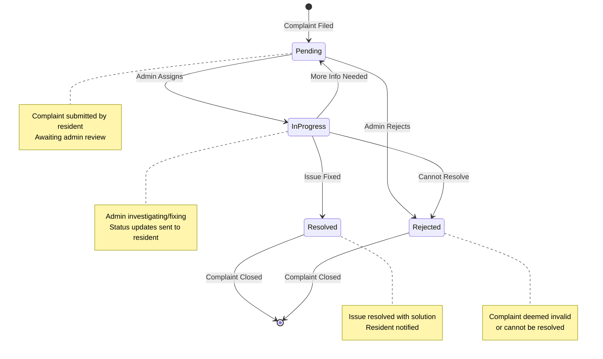

## 11. Data Flow Diagram - Level 0 (Context Diagram)

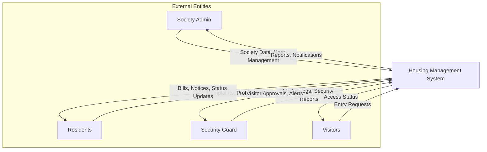

## 12. Package Diagram - Code Organization

```mermaid
graph TB
    subgraph "com.app"
        subgraph "controller"
            AUTH_CTRL[AuthController]
            SOC_CTRL[SocietyController]
            COMP_CTRL[ComplaintController]
            VIS_CTRL[VisitorController]
            WS_CTRL[WebSocketController]
        end

        subgraph "service"
            AUTH_SVC[AuthService]
            SOC_SVC[SocietyService]
            COMP_SVC[ComplaintService]
            VIS_SVC[VisitorService]
            NOTIF_SVC[NotificationService]
        end

        subgraph "dao"
            USER_DAO[UserDao]
            SOC_DAO[SocietyDao]
            COMP_DAO[ComplaintDao]
            VIS_DAO[VisitorDao]
        end

        subgraph "model"
            USER[User]
            SOCIETY[Society]
            COMPLAINT[Complaint]
            VISITOR[Visitor]
        end

        subgraph "dto"
            USER_DTO[UserDTO]
            SOC_DTO[SocietyDTO]
            COMP_DTO[ComplaintDTO]
            VIS_DTO[VisitorDTO]
        end

        subgraph "security"
            JWT_UTIL[JwtUtil]
            JWT_FILTER[JwtAuthFilter]
            SEC_CONFIG[SecurityConfig]
        end

        subgraph "config"
            WS_CONFIG[WebSocketConfig]
            CORS_CONFIG[CorsConfig]
        end

        subgraph "exception"
            GLOBAL_HANDLER[GlobalExceptionHandler]
            CUSTOM_EX[Custom Exceptions]
        end

        subgraph "mapper"
            USER_MAPPER[UserMapper]
            COMP_MAPPER[ComplaintMapper]
            VIS_MAPPER[VisitorMapper]
        end
    end

    %% Dependencies
    controller --> service
    service --> dao
    dao --> model
    controller --> dto
    service --> dto
    mapper --> model
    mapper --> dto
    controller --> security
    service --> security
```